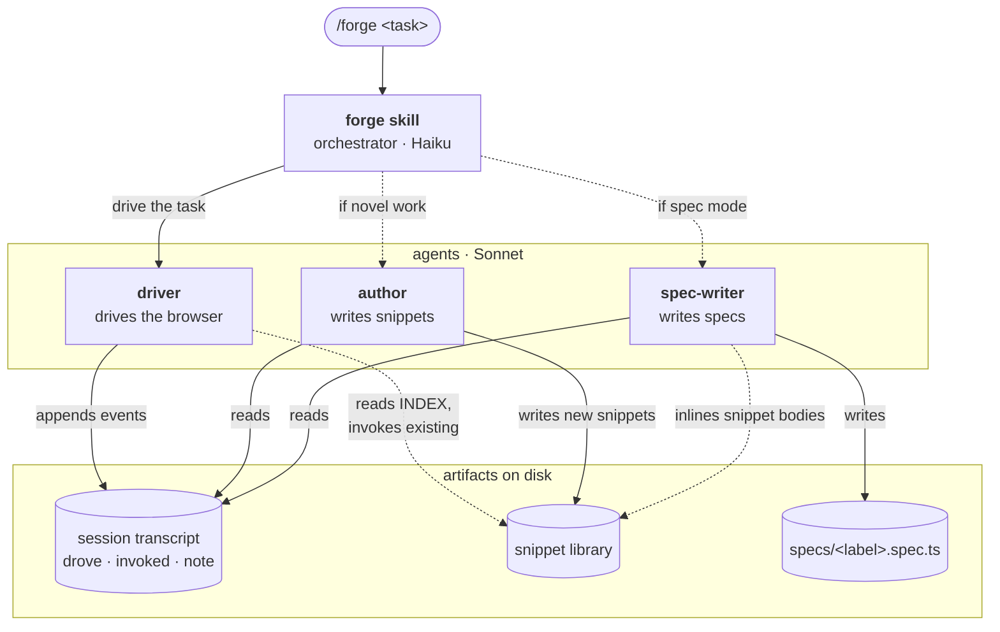
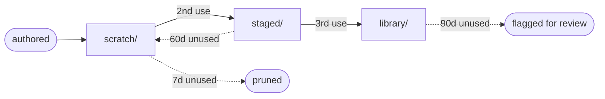

# forge

A browser assistant for repeatable user actions.

`forge` lets Claude drive your live browser session — fill the form you fill every week, paste a GIF into a PR description, navigate a five-step UI you'd rather not click through again. The first time Claude does it, forge captures the path as a small `.ts` snippet. Next time you ask, it's already in the library; one fast invocation rather than a fresh investigation.

The plugin owns the *browser as a long-lived daemon*: you attach (or launch) once, and Claude, you, and any future tooling all act on the same window via the named `forge` playwright-cli session. Specs are downstream — if a flow becomes worth pinning into CI, forge can synthesise a real Playwright spec from a recorded drive.

## Install

```bash
claude plugin marketplace add vivecuervo7/claude-plugins
claude plugin install forge@vive-claude
```

First use bootstraps a data root under `~/.claude/.vive-claude/forge/`. The bootstrap is idempotent.

## Requirements

- **playwright-cli** — `brew install playwright-cli`. Forge is a wrapper, not a replacement.
- **macOS** for now (the managed-launch fallback targets `/Applications/Google Chrome.app`; the CDP-attach path works against any Chromium-family browser).
- **Node.js** — any recent version (tested on 24).

## Attaching to your existing browser

For "take-the-reins" mode where Claude acts on the browser session you've been using, launch your everyday Chromium-family browser (Chrome, Arc, Brave, Edge) with `--remote-debugging-port=9222`:

```bash
alias chrome='/Applications/Google\ Chrome.app/Contents/MacOS/Google\ Chrome --remote-debugging-port=9222 --user-data-dir=$HOME/.cache/chrome-cdp'
```

When `forge-session.sh` runs and detects the CDP port, it'll attach. Skip the CDP setup and it'll launch a managed Chrome with its own persistent profile instead.

## Commands

| Command | Description |
|---------|-------------|
| `/forge <description>` | Drive a task end-to-end. Reuses existing snippets where they fit, authors new ones for novel steps. |
| `/forge snippet <name> [args]` | Cheap invocation of a known snippet — bypasses the agents, just runs the registry. |
| `/forge spec [url-or-description]` | *Optional export.* Drive the task (or work retrospectively from the session transcript) and synthesise a runnable `.spec.ts` — useful when a flow becomes worth pinning into CI. |
| `/forge doctor` | Read-only diagnostic checklist — confirms data root, snippet tiers, playwright-cli install, session state, and CDP browser presence. |

The skill also fires on natural-language phrases like `"use forge to ..."` — see [Invocation paths](#invocation-paths) for the routing tradeoff.

## How it works

Three single-purpose agents fan out from a Haiku-driven skill, with the session transcript as the contract between them. The driver does all the browser work; downstream agents read its log with full hindsight and produce snippets or specs.



- **Driver never authors.** It reads `INDEX.md`, invokes existing snippets where they fit, drives novel actions inline, and leaves a flat log. Naming, chunking, and intent-detection are downstream agents' jobs.
- **The transcript is the only contract.** Three event types — `drove` (raw browser actions), `invoked` (existing-snippet calls with args + result), `note` (optional driver annotations). The author and spec-writer consume it independently.
- **Author is conditional, spec-writer is mode-gated.** If the transcript contains only `invoked` events (library reuse was complete), the author is skipped. The spec-writer runs only when invoked via `/forge spec ...`.
- **Specs run without host project setup.** Generated specs run via `forge-spec.mjs run <label>` against an isolated Playwright workspace at `~/.claude/.vive-claude/forge/runner/`.

### Snippet lifecycle



New snippets land in `scratch/`. Repeat use promotes them — `library/` entries are never auto-deleted. Thresholds configurable via `FORGE_STAGE_AT` / `FORGE_LIBRARY_AT`; cleanup runs via `forge-registry.mjs prune`.

## Invocation paths

Forge exposes two routes, deliberately differentiated:

| Path | Trigger | Behaviour |
|---|---|---|
| **Slash** | `/forge:forge <description>` or `/forge:forge snippet <name>` | Runs entirely on Haiku — the `model: haiku` pin re-engages on every fresh slash invocation. |
| **Natural language** | `"use forge to ..."` | Session model (e.g. Opus) decides whether to trigger the skill; the skill body still runs on Haiku. |

The slash path is the cheap-and-predictable case for routine reuse. The natural-language path costs more on the first hit but is the discovery affordance — useful when you don't know the snippet name yet. Wall-time floor is browser I/O (typically 10–50s for a page navigation + scrape) regardless of path; on slash invocations, the model side is negligible relative to that floor.

## Use cases

The library accretes from real repetition. A few representative shapes:

- **Routine drudgery.** "Delete all emails from `noreply@noisy-vendor.com`."
- **PR / GitHub flows.** "Paste the GIF at `~/Desktop/demo.gif` into the description of PR #42."
- **Multi-step forms.** JIRA submissions, expense reports, deploy approval pages.
- **Triage and verification.** "Open the dashboard, check the error count, click into anything > 50, screenshot."
- **API-less integrations.** Apps without public APIs are still driveable via their UI. A snippet *is* the integration.

## Storage

Runtime data lives at `~/.claude/.vive-claude/forge/`:

```
~/.claude/.vive-claude/forge/
├── INDEX.md              # auto-generated retrieval index (name — description per line)
├── stats.json            # per-snippet { tier, useCount, lastUsed, createdAt }
├── scratch/              # see Snippet lifecycle above
├── staged/
├── library/
├── broken/               # quarantined after failed repair
├── sessions/             # per-Claude-session transcripts (drove + invoked + note events)
├── specs/                # generated `<label>.spec.ts` files
├── runner/               # bundled Playwright workspace used by `forge-spec.mjs run`
└── chromium-profile/     # dedicated profile for managed-launch fallback
```

Nothing here belongs in a git repo. Snippets may contain user-specific selectors, URLs, or paths captured during authoring — keep them off-disk-of-record.

## License

MIT
