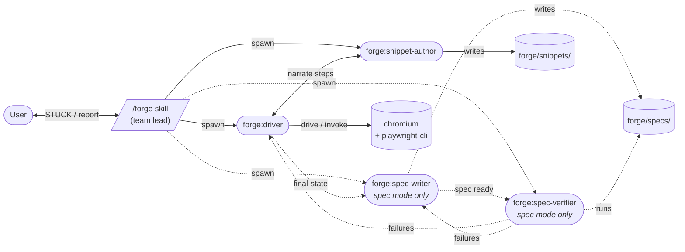

# forge

A browser-automation team for Claude Code. Forge spawns a small mesh of agents that drive a real browser, capture reusable snippets, and (on request) compose verified Playwright specs from the work.

The default mode just does the thing you asked for. Spec mode is opt-in for when a flow is worth pinning into CI.

## Requirements

- **Node.js** — any recent version (tested on 24).
- **playwright-cli** — `brew install playwright-cli`. Forge wraps it.

Supported on macOS, Linux, and Windows. Forge's scripts are pure Node; cross-platform locking, JSON state, and hashing are handled internally — no `bash`, `jq`, `flock`, or `md5sum` required on the host.

## Quick start

1. **Install the plugin** (one time per machine):

   ```bash
   claude plugin marketplace add vivecuervo7/forge
   claude plugin install forge@vive-forge
   ```

2. **Enable experimental agent teams** in `~/.claude/settings.json`, then restart Claude Code:

   ```json
   { "env": { "CLAUDE_CODE_EXPERIMENTAL_AGENT_TEAMS": "1" } }
   ```

3. **Scaffold your project** from inside it:

   ```
   /forge init
   ```

   This creates `forge/` with a `hints/` directory, a fallback Playwright config, and a self-documenting `.gitignore`.

4. **Drive a task:**

   ```
   /forge add the backpack to the cart
   ```

   That's enough to start. For an unauthenticated site, the scaffold alone is sufficient — forge launches a fresh chromium and goes. For sites with auth or other project-specific behaviour, author hint files in `forge/hints/` (see `forge/hints/README.md` for guidance). All five hints are optional and additive: write only what you need.

On first spec run (or first snippet invocation), forge lazy-installs its Playwright runner directly into the project's `forge/` directory (standard `package.json` + `node_modules/` layout). Self-contained per project, visible in the IDE, removed cleanly by `rm -rf forge/` if you ever want to uninstall.

## Commands

| Command | What it does |
|---|---|
| `/forge init` | Scaffolds the `forge/` directory convention into the current project. Idempotent. The starting point for any new project. |
| `/forge <task>` | **Drive mode.** Driver + snippet-author. Does the task end-to-end, accretes reusable snippets from novel work. The everyday command. |
| `/forge spec <task>` | **Spec mode.** Adds spec-writer + spec-verifier. Composes a self-contained `.spec.ts` and confirms it passes from a cold start. |
| `/forge teach <topic>` | **Teach mode.** Driver + snippet-author. User pilots forge turn-by-turn, signals snippet boundaries explicitly, and weaves project-specific gotchas (fallbacks, retries, conditional branches) into snippet bodies. The deliberate library-building channel — useful when the app has quirks the agent can't be expected to discover. |
| `/forge run <spec\|last\|latest>` | Re-runs a verified spec via the standalone runner. Add `record as <label>` to capture a video at `forge/videos/<spec>-<label>.webm`. No team spawned. |
| `/forge export <spec-name>` | Exports a composed spec to a self-contained inlined form, suitable for shipping into another test suite. |

Spec mode also fires on natural-language signals — "create a spec for AE-1775", "write a spec that…", "capture as a spec". Teach mode fires on phrasings like "teach forge how to log in" or "let me show forge how to create an event." Plain `/forge <task>` is the unambiguous drive case.

Recording is on demand: `/forge run last spec, record as before` → fix the bug → `/forge run last spec, record as after` → attach both videos to the PR. The same spec produces paired evidence.

## Three pillars: drive, teach, spec

Each mode does a different job. Pick by what you want out of the session.

**Drive (`/forge <task>`)** — fastest path. Forge does the task; the snippet-author accretes any novel work into the library opportunistically. Best when you want the action performed and any library growth is a side benefit.

**Teach (`/forge teach <topic>`)** — deliberate library building. You pilot forge step-by-step through the conversation, signal snippet boundaries explicitly, and bake gotchas (auto-login fallback, stuck-loader retry, dispatchEvent quirks) into the snippet bodies. Best when the app has quirks the agent can't be expected to discover on its own — login flows, conditional UIs, anything where "the obvious approach doesn't work."

**Spec (`/forge spec <task>`)** — pin a verified flow. Forge drives, writes a self-contained `.spec.ts`, and confirms it passes from cold. Best when the flow is worth a CI test artifact and paired before/after evidence (via `/forge run`).

Teach-mode mechanics in brief:

- The user is the snippet curator. The driver doesn't autonomously plan — it executes one user-translated action at a time.
- **Instructions and snippets are orthogonal.** A user instruction is one browser action; a snippet may span many instructions (or just one, or none). The user walks forge through the work, then caps a snippet when they reach a meaningful boundary — usually after several steps. Most instructions won't be cap-points.
- The user can take over the browser mid-session for state setup ("I'll create the test event myself"); user-driven actions are not recorded. A bearing-grounding statement ("I'm now on /event/123") gets the agent re-oriented before the next directed step.
- Snippet boundaries are user-signalled: "cap that as `login`" / "save the last four steps as `create-event`." If the name already exists, the user gets an explicit replace-or-rename choice — overwrite protection is user-driven here, not author-driven.
- Annotations the user volunteers (or that fall out of the conversation) get woven into the snippet body, not just the description. This is the load-bearing knowledge — the bit the driver would have missed.

## Architecture

Four agents communicate in a mesh via `SendMessage`. The `/forge` skill is the **team lead** — it spawns teammates, manages the lifecycle (session start, team creation, shutdown), and bridges the user channel for STUCK escalations.



| Agent | Role |
|---|---|
| `forge:driver` | Drives the browser via `playwright-cli` against a fresh chromium session. Invokes existing snippets where they match; drives fresh otherwise. |
| `forge:snippet-author` | Listens to driver narration during the drive. Writes per-step snippets for novel work into `forge/snippets/`. |
| `forge:spec-writer` *(spec mode)* | Composes a self-contained `.spec.ts` after the drive completes. Imports snippets for invoked steps; inlines code for fresh-drive steps. |
| `forge:spec-verifier` *(spec mode)* | Runs the spec via `forge-run-spec.mjs` against a fresh browser context, surfaces pass/fail. Iterates with driver / spec-writer on failure. |

Dashed edges fire only in spec mode. Drive mode runs the top two agents (driver + snippet-author) and stops once the task is done — no spec artifact produced. Teach mode also runs just driver + snippet-author, but the lead's role is much more active — it pipes user input to the driver turn-by-turn and only writes snippets when the user explicitly caps them.

## Session model

Each `/forge` invocation is stateless: launch a fresh chromium with an ephemeral profile, run the user's task, close the chromium at the end. No pool, no persistent slot directories, no claim/release lifecycle, no profile to scrub. Clean state every time, by design.

**Personas and credentials are a project concern**, not forge's. Projects with multiple test accounts document them in `forge/hints/forge.md` — a plain-prose persona table that the driver reads at session start ("admin uses ADMIN_USERNAME / ADMIN_PASSWORD," "user1 uses USER1_USERNAME / USER1_PASSWORD," "fresh users are minted via this SQL"). When the user names a persona ("log in as admin"), the driver resolves credentials per the hint and passes them into snippet invocations via `$env.KEY` references (the substitution happens before the args cross the playwright-cli sandbox, so literal credential values stay out of tool-call transcripts).

For parallel runs against the same project: use different personas — two `/forge` sessions, one as `admin`, one as `user1`, work in parallel as long as the project's backend isn't single-session-per-user for the same account. The single-session-per-user constraint (if it exists) is documented in `forge.md` and is the user's responsibility to respect.

## Hints

`forge-init` scaffolds `forge/hints/` with one file per consumer. Hints are natural-language instructions to the agents, not config.

| File | Read by |
|---|---|
| `forge.md` | The skill + driver (env contract, personas, setup, teardown) |
| `driver.md` | `forge:driver` (app structure, selector inventory, gotchas) |
| `snippet-author.md` | `forge:snippet-author` (project-specific snippet conventions) |
| `spec-writer.md` | `forge:spec-writer` (spec naming, imports) |
| `spec-verifier.md` | `forge:spec-verifier` (verification conventions) |

**All hints are optional.** Forge drives correctly against the bare scaffold — the defaults cover unauthenticated sites with no special setup. Author hint files only to encode project-specific knowledge the agents can't discover on their own:

- **`forge.md`** — usually the first one worth writing if your site has auth, a custom provisioning recipe, or pre-/post-run state needs.
- **`driver.md`** — worth writing once you've watched a few drives and noticed the driver enumerating selectors the docs could've handed it.
- **The other three** — write only if the project-default behaviour collides with what you want.

### Setup / teardown

`forge.md`'s `## Setup before each run` section drives the lead's pre-drive work. Examples:

```markdown
## Setup before each run

Create a fresh test user:

\`\`\`sql
INSERT INTO users (email, role)
VALUES ('test-' || gen_random_uuid() || '@example.com', 'standard')
\`\`\`

Capture the generated email; the spec needs it as the login identity.
```

Or simply:

```markdown
## Setup before each run

Don't reset any state — runs share state intentionally.
```

The default scrub fires unless the hint says not to. `## Teardown after each run` is the symmetric escape hatch for end-of-run cleanup forge can't infer (server-side state, logout endpoints).

## Storage layout

```
<project>/forge/
├── hints/                  # committed — your project's knowledge
│   ├── forge.md
│   ├── driver.md
│   ├── snippet-author.md
│   ├── spec-writer.md
│   └── spec-verifier.md
├── snippets/               # gitignored — accreted via snippet-author
├── specs/                  # gitignored — composed during spec mode
├── videos/                 # gitignored — recordings from /forge run
├── node_modules/           # gitignored — lazy-installed runner deps
├── package.json            # gitignored — forge-managed runner manifest
├── playwright.config.ts    # gitignored — scaffolded fallback runner config
├── .env                    # gitignored — forge-specific env
├── .gitignore              # gitignored — self-ignores; only hints/ tracked
└── README.md               # gitignored — scaffold, points at conventions doc
```

Only `hints/` is tracked. Everything else is local per-machine. `forge-init` regenerates the rest from convention. See the scaffold's inline comments for adapting to projects with their own Playwright runner.

## Credentials

Forge speaks dotenv natively. Three layers, last-set wins:

1. **`<project-root>/.env`** — baseline.
2. **`forge/.env`** — forge-specific overrides.
3. **`<slot>/.env`** — per-persona overrides (injected by `--slot` on wrapper scripts).

User shell env (e.g. `direnv` with 1Password injecting `OP_TOKEN`) sits on top — already in `process.env` when the wrappers start; wins via `dotenv`'s non-override default. Direnv is your personal layer, not forge's mechanism.

## Use cases

- **Routine drudgery.** "Delete all emails from `noreply@noisy-vendor.com`."
- **PR / GitHub flows.** "Paste the GIF at `~/Desktop/demo.gif` into PR #42's description."
- **Multi-step forms.** JIRA submissions, expense reports, deploy approval pages.
- **Triage + verification.** "Open the dashboard, check the error count, screenshot anything > 50."
- **Bug repro + verification specs.** `/forge spec AE-1775 add backpack` to author the spec, then `/forge run last spec, record as before` → fix bug → `/forge run last spec, record as after`. Paired evidence for the PR.
- **Library bootstrap on a new app.** `/forge teach login` to walk forge through the auth flow once, encoding the auto-login detection and stuck-loader retry — then every future drive/spec invocation invokes the snippet and never re-discovers the quirks.

## License

MIT
