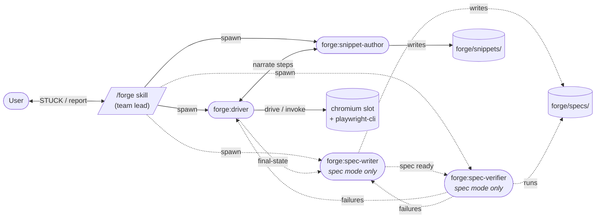

# forge

A browser-automation team for Claude Code. Forge spawns a small mesh of agents that drive a real browser, capture reusable snippets, and (on request) compose verified Playwright specs from the work.

The default mode just does the thing you asked for. Spec mode is opt-in for when a flow is worth pinning into CI.

## Requirements

- **playwright-cli** — `brew install playwright-cli`. Forge wraps it.
- **macOS or Linux**. Lock file primitives use `flock` (Linux) or `lockf` (macOS).
- **Node.js** — any recent version (tested on 24).
- **jq** — used by the pool scripts for state.json edits.

## Quick start

1. **Install the plugin** (one time per machine):

   ```bash
   claude plugin marketplace add vivecuervo7/claude-plugins
   claude plugin install forge@vive-claude
   ```

2. **Enable experimental agent teams** in `~/.claude/settings.json`, then restart Claude Code:

   ```json
   { "env": { "CLAUDE_CODE_EXPERIMENTAL_AGENT_TEAMS": "1" } }
   ```

3. **Scaffold your project** from inside it:

   ```
   /forge init
   ```

   This creates `forge/` with a `hints/` directory, a fallback Playwright config, and a self-documenting `.gitignore`.

4. **Author `forge/hints/forge.md`** — the only required hint. At a minimum it declares the env contract (which env keys each pool slot needs) and a provisioning recipe (how to mint a new slot). See `forge/hints/README.md` after scaffolding for guidance.

5. **Drive a task:**

   ```
   /forge log in and add the backpack to the cart
   ```

The plugin lazy-installs its Playwright runner under `~/.claude/.vive-claude/forge/runner/` on first spec run.

## Commands

| Command | What it does |
|---|---|
| `/forge <task>` | **Drive mode.** Driver + snippet-author. Does the task end-to-end, accretes reusable snippets from novel work. Fastest path. |
| `/forge spec <task>` | **Spec mode.** Adds spec-writer + spec-verifier. Composes a self-contained `.spec.ts` and confirms it passes from a cold start. |
| `/forge run <spec\|last\|latest>` | Re-runs a verified spec via the standalone runner. Add `record as <label>` to capture a video at `forge/videos/<spec>-<label>.webm`. No team spawned; no slot claimed. |
| `/forge init` | Scaffolds the `forge/` directory convention into the current project. Idempotent. |
| `/forge export <spec-name>` | Exports a composed spec to a self-contained inlined form, suitable for shipping into another test suite. |

Spec mode also fires on natural-language signals — "create a spec for AE-1775", "write a spec that…", "capture as a spec". Plain `/forge <task>` is the unambiguous drive case.

Recording is on demand: `/forge run last spec, record as before` → fix the bug → `/forge run last spec, record as after` → attach both videos to the PR. The same spec produces paired evidence.

## Architecture

Four agents communicate in a mesh via `SendMessage`. The `/forge` skill is the **team lead** — it spawns teammates, manages the lifecycle (slot claim, team creation, shutdown), and bridges the user channel for STUCK escalations.



| Agent | Role |
|---|---|
| `forge:driver` | Drives the browser via `playwright-cli` against a claimed slot. Invokes existing snippets where they match; drives fresh otherwise. |
| `forge:snippet-author` | Listens to driver narration during the drive. Writes per-step snippets for novel work into `forge/snippets/`. |
| `forge:spec-writer` *(spec mode)* | Composes a self-contained `.spec.ts` after the drive completes. Imports snippets for invoked steps; inlines code for fresh-drive steps. |
| `forge:spec-verifier` *(spec mode)* | Runs the spec via `forge-pool-run-spec.mjs` against the still-warm slot, surfaces pass/fail. Iterates with driver / spec-writer on failure. |

Dashed edges fire only in spec mode. Drive mode runs the top two agents (driver + snippet-author) and stops once the task is done — no spec artifact produced.

## Pool + slot model

Forge owns a per-project pool of chromium "slots." Each slot is persona-bound (e.g. `slot-standard_user`, `slot-problem_user`) with its own profile dir and `.env` for credentials. Claims are serialized by a file lock; two concurrent `/forge` invocations grab different slots and run in parallel.

At claim time, the lead invokes a filesystem-level scrub of cookies + localStorage + sessionStorage on the slot's profile — covers the universally-biting class without depending on the previous chromium session being alive. Project-specific cleanup (database resets, account churn, third-party state) is hint-driven (see below).

## Hints

`forge-init` scaffolds `forge/hints/` with one file per consumer. Hints are natural-language instructions to the agents, not config.

| File | Read by |
|---|---|
| `forge.md` | The skill (env contract, provisioning recipe, setup, teardown) |
| `driver.md` | `forge:driver` (app structure, gotchas) |
| `snippet-author.md` | `forge:snippet-author` (project-specific snippet conventions) |
| `spec-writer.md` | `forge:spec-writer` (spec naming, imports) |
| `spec-verifier.md` | `forge:spec-verifier` (verification conventions) |

All are optional. The minimum to be operational is `forge.md` with an env contract + provisioning recipe.

### Setup / teardown

`forge.md`'s `## Setup before each run` section drives the lead's pre-drive work. Examples:

```markdown
## Setup before each run

Create a fresh test user:

\`\`\`sql
INSERT INTO users (email, role)
VALUES ('test-' || gen_random_uuid() || '@example.com', 'standard')
\`\`\`

Capture the generated email; the spec needs it as the login identity.
```

Or simply:

```markdown
## Setup before each run

Don't reset any state — runs share state intentionally.
```

The default scrub fires unless the hint says not to. `## Teardown after each run` is the symmetric escape hatch for end-of-run cleanup forge can't infer (server-side state, logout endpoints).

## Storage layout

```
<project>/forge/
├── hints/                  # committed
│   ├── forge.md
│   ├── driver.md
│   ├── snippet-author.md
│   ├── spec-writer.md
│   └── spec-verifier.md
├── .pool/                  # gitignored — slot state
│   ├── slot-<persona>/
│   │   ├── .env           # per-persona credentials
│   │   ├── profile/       # chromium profile
│   │   └── state.json     # { checkedOutBy, lastClaimed, lastReleased }
│   └── ...
├── snippets/               # gitignored by default — accreted via author
├── specs/                  # gitignored — composed during spec mode
├── videos/                 # gitignored — recordings from /forge run
├── .env                    # gitignored — forge-specific env
├── playwright.config.ts    # scaffold — fallback if no project runner
└── .gitignore              # self-ignores; only hints/ tracked by default
```

Only `hints/` is tracked. Everything else is local per-machine. `forge-init` regenerates the rest from convention. See the scaffold's inline comments for adapting to projects with their own Playwright runner.

## Credentials

Forge speaks dotenv natively. Three layers, last-set wins:

1. **`<project-root>/.env`** — baseline.
2. **`forge/.env`** — forge-specific overrides.
3. **`<slot>/.env`** — per-persona overrides (injected by `--slot` on wrapper scripts).

User shell env (e.g. `direnv` with 1Password injecting `OP_TOKEN`) sits on top — already in `process.env` when the wrappers start; wins via `dotenv`'s non-override default. Direnv is your personal layer, not forge's mechanism.

## Use cases

- **Routine drudgery.** "Delete all emails from `noreply@noisy-vendor.com`."
- **PR / GitHub flows.** "Paste the GIF at `~/Desktop/demo.gif` into PR #42's description."
- **Multi-step forms.** JIRA submissions, expense reports, deploy approval pages.
- **Triage + verification.** "Open the dashboard, check the error count, screenshot anything > 50."
- **Bug repro + verification specs.** `/forge spec AE-1775 add backpack` to author the spec, then `/forge run last spec, record as before` → fix bug → `/forge run last spec, record as after`. Paired evidence for the PR.

## License

MIT
